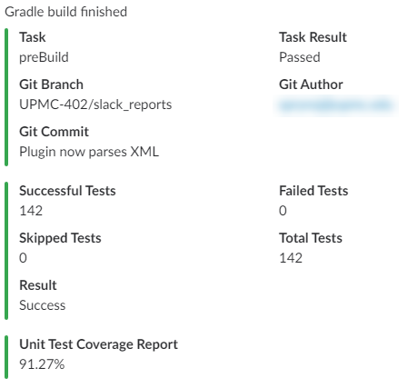
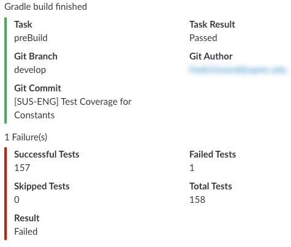

[](https://travis-ci.org/oliverspryn/gradle-slack-plugin) [](https://codeclimate.com/github/oliverspryn/gradle-slack-plugin/maintainability) [](https://jitpack.io/#com.github.oliverspryn/gradle-slack-plugin)

# Gradle Slack plugin

This Gradle plugin can send messages to a Slack channel in accordance with the various steps of your build lifecycle. It may be useful to integrate with a CI server, share unit testing metrics, and to notify everyone when a Gradle build task has failed.

This project builds upon the original [Gradle Slack plugin](https://github.com/Mindera/gradle-slack-plugin), and adds the ability to report JUnit summaries and Jacoco coverage reports to Slack and the build console.




## Usage

The plugin is available in [JitPack](https://jitpack.io/). Just add the following to your `buildscript` dependencies:

```groovy
buildscript {
    dependencies {
        classpath 'com.github.oliverspryn:gradle-slack-plugin:1.1.1'
    }

    repositories {
        maven { url "https://jitpack.io" }
    }
}

task coverage(type: JacocoReport) {
    // Custom Jacoco coverage task
}

task preBuild() {
    // Generic build step
    // Already present in Android Studio
}

task testDebugUnitTest() {
    // JUnit task
    // Already present in Android Studio
}

slack {
    dependsOnTasks 'preBuild', 'coverage', 'testDebugUnitTest'
    url 'your WebHook URL'
}
```

Apply it:

```groovy
apply plugin: 'tech.oliver.gradle.slack'
```

## Configuration

First, you need to setup Slack to receive incoming messages:

1. Go to *your_team*.slack.com/services/new/incoming-webhook

1. Press Add Incoming WebHooks Integration

1. Grab your WebHook URL

Then in your build.gradle file:

```groovy
slack {
    url 'your WebHook URL'
}
```

By default, every time a build fails a slack message will be sent to the channel you configured. If a build succeeds nothing happens.

There are more optional fields which enable you to further configure the Slack integration:

```groovy
slack {
    calculateAverageCoverage true
    coverageGood 90.0
    coverageTypes 'branch', 'class', 'complexity', 'instruction', 'line', 'method'
    coverageWarn 80.0
    dependsOnTasks 'testDebug', 'publishApkRelease'
    enabled = isCDMachine()
    showCoverage true
    showConsoleReports true
    showUnitTest true
    url 'your WebHook URL'
}
```

* `calculateAverageCoverage`: `true` by default. If more than one `coverageType` is specified, this sets whether or not to calculate and display the average of all the coverage metrics, in addition to the `coverageTypes` specified below.
* `coverageGood`: `90.0` by default. The minimum acceptable amount indicating whether Slack marks the coverage percentage as green.
* `coverageTypes`: `instruction` by default. Displays the various types metrics calculated by Jacoco. By default, Jacoco calculates: 'branch', 'class', 'complexity', 'instruction', 'line' and 'method'. This list may contain any combination of these values.
* `coverageWarn`: `80.0` by default. The minimum warning amount indicating whether Slack marks the coverage percentage as yellow.
* `dependsOnTasks`: Empty by default. Specify a list of tasks which will trigger a message to Slack, regardless of whether it failed or succeeded.
* `enabled`: `true` by default. A boolean to define whether or not the Slack integration is active, useful to avoid sending messages on your local builds.
* `showCoverage`: `true` by default. Show the coverage metrics in a Slack message, and in the console, if `showConsoleReports` is `true`.
* `showConsoleReports`: `true` by default. A boolean indicating whether or not the plugin prints the same output to the build console.
* `showUnitTest`: `true` by default. Show the number of passing and failing unit tests in a Slack message, and in the console, if `showConsoleReports` is `true`.

## Credits

[Gradle Slack plugin](https://github.com/Mindera/gradle-slack-plugin) by [Mindera](https://github.com/Mindera), the original project which this fork enhances

[Slack WebHook Java API](https://github.com/gpedro/slack-webhook) by [gpedro](https://github.com/gpedro)

## License

gradle-slack-plugin is available under the MIT license. See the LICENSE file for more information.
